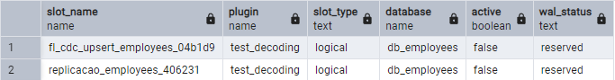
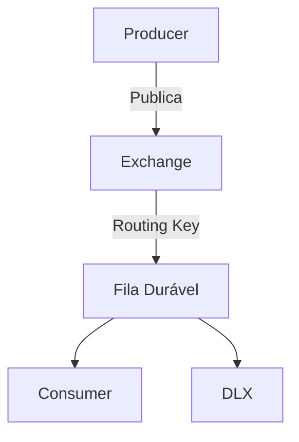
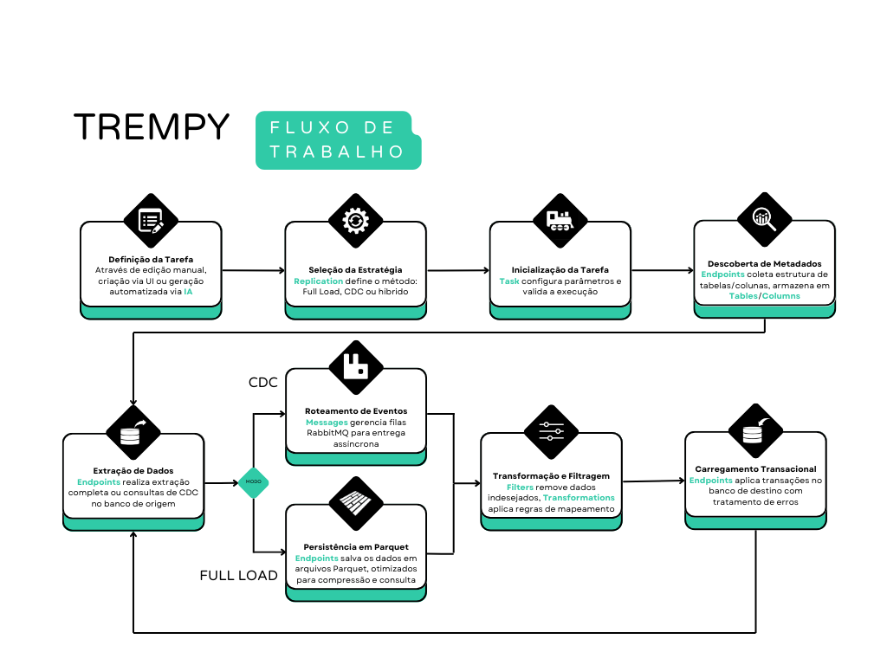

## Descrição
O **TREMpy** é uma sistema de replicação transacional desenvolvido em Python, projetado para facilitar a replicação de dados entre SGBDs (inicialmente projeto para PostgreSQL) utilizando técnicas modernas de captura de dados de alteração (CDC) e integração com mensageria via RabbitMQ. Com uma interface intuitiva baseada em Streamlit e suporte a orquestração via Docker, o TREMpy oferece uma solução flexível e extensível para cenários de replicação, monitoramento e automação de fluxos de dados.

## Conteúdos
- [Instalação](#instalação)
- [Usando PostgreSQL](#usando-postgresql)
- [Configuração e Uso do RabbitMQ](#configuração-e-uso-do-rabbitmq)
- [Configuração e Uso do Docker](#configuração-e-uso-do-docker)
- [Estrutura do Projeto](#estrutura-do-projeto)
- [Uso da IA](#uso-da-ia)
- [Licença](#licença)
- [Contato](#contato)


## Instalação

Antes de começar, certifique-se de que os seguintes pré-requisitos estão instalados no seu ambiente:

- **Python 3.10 ou superior**
- **Docker** (caso deseje executar o projeto em containers)
- **Docker Compose** (para orquestração dos containers)

### Executando Localmente

Você pode executar o TREMpy de duas formas:

1. **Com Interface Gráfica (UI)**:
   ```bash
   streamlit run app.py
   ```
   Isso iniciará a interface Streamlit no endereço `http://localhost:8501`.

2. **Diretamente sem UI** (para execução de tarefas em background):
   ```bash
   python manager.py
   ```

### Executando com Docker

Para executar o projeto em um container Docker, siga os passos básicos abaixo. Para configurações avançadas, consulte o manual completo em [`README_DOCKER.md`](README_DOCKER.md):

```bash
# Construir a imagem
docker-compose build

# Iniciar os serviços
docker-compose up -d
```

## Usando PostgreSQL

Para utilizar o PostgreSQL com o TREMpy, é necessário de um usuário com permissões de **super-user**.

### Sobre Replication Slots no PostgreSQL

O TREMpy utiliza o recurso de *replication slots* do PostgreSQL para garantir a captura confiável e contínua das alterações realizadas no banco de dados de origem. Um replication slot é um mecanismo nativo do PostgreSQL que mantém o histórico das mudanças (WALs) necessárias para que consumidores externos possam ler todas as alterações, sem risco de perda de dados, mesmo que haja interrupções temporárias na conexão.

No contexto do TREMpy, cada tarefa de replicação criada recebe seu próprio replication slot dedicado. Isso permite que múltiplas tarefas operem de forma independente, cada uma acompanhando as alterações de suas tabelas de interesse, sem interferência entre si.

Além disso, o gerenciamento automático dos replication slots pelo TREMpy evita o acúmulo de slots antigos e garante que apenas os slots necessários estejam ativos, otimizando recursos e prevenindo problemas de armazenamento de WALs não consumidos.

</img>

Para mais informações sobre *replicatin slots*, acesse a [documentação oficial](https://www.postgresql.org/docs/9.4/catalog-pg-replication-slots.html)

### Configuração em `postgresql.conf`:
```
wal_level = logical
max_replication_slots = 5 # recomendado > 20
max_wal_senders = 5       # recomendado = max_replication_slots

# Para conexões via Docker
listen_addresses = '*'     # permite conexões de qualquer interface
```

### Configuração em `pg_hba.conf`:
```
# Pré-requisito obrigatório para replicação, tanto usando Docker quanto sem Docker:
host replication all 0.0.0.0/0 trust
```

### Configuração de Rede para Docker
Para garantir que o PostgreSQL aceite conexões do container Docker, adicione as seguintes entradas ao `pg_hba.conf`:

```
host all all 172.17.0.0/16 md5   # rede do Docker
host all all 172.26.64.0/20 md5  # Rede do WSL
host all all 192.168.1.0/24 md5  # Sua rede Wi-Fi
```

> **Nota**: Ao configurar a conexão na interface do Streamlit, use o Endereço IPv4 como host quando estiver rodando a aplicação via Docker. Este é o IP que o container Docker usará para se comunicar com seu PostgreSQL local.

## Configuração e Uso do RabbitMQ

O TREMpy implementa um padrão de mensageria com RabbitMQ, organizado em três componentes principais:

### 1. Topologia de Mensagens
- **Exchange Principal**: `trempy_exchange_{task_name}` (tipo direct/duravel)
- **DLX**: `trempy_dlx_exchange_{task_name}` (para tratamento de falhas)
- **Filas**:
  - Principal: `trempy_queue_{task_name}` (com DLX configurada)
  - DLX: `dlx_queue_{task_name}` (armazena mensagens falhas)

### 2. Fluxo de Operação
| Componente         | Função                                                                 | Destaques                                                                 |
|--------------------|-----------------------------------------------------------------------|---------------------------------------------------------------------------|
| **MessageProducer** | Publica mensagens de alterações CDC                        | - Mensagens persistentes (delivery_mode=2) |
| **MessageConsumer** | Consome e processa mensagens da fila principal                       | - Prefetch=1 (processamento serializado)<br>- Ack manual<br>- DLX automática em falhas |
| **MessageDlx**      | Gerencia mensagens falhas na DLX                                     | - Log centralizado de erros       |

### 3. Garantias de Entrega
- **Persistência**: Mensagens sobrevivem a reinicializações do broker
- **Tratamento de Falhas**: 
  - DLX redireciona mensagens não processadas após 3 tentativas
  - Logs estruturados com `transaction_id` para rastreabilidade
- **Controle de Fluxo**: 
  - Prefetch_count=1 evita sobrecarga no consumidor
  - Metadados de performance registrados via `MetadataConnectionManager`

### 4. Fluxo



### Configuração Local do RabbitMQ (Windows)

> **OBS**: Para uso do TREMpy no Docker, esta etapa não é necessária.

#### Pré-requisitos Essenciais
1. Instalar [Erlang](https://www.erlang.org/downloads) (versão compatível)
2. Instalar [RabbitMQ para Windows](https://www.rabbitmq.com/install-windows.html)

#### Configuração Mínima Necessária
```cmd
:: 1. Iniciar serviço (após instalação)
net start RabbitMQ

:: 2. Habilitar interface de gerenciamento (opcional)
rabbitmq-plugins enable rabbitmq_management

:: 3. Reiniciar o serviço
net stop RabbitMQ && net start RabbitMQ
```

#### Verificação Básica
```cmd
:: Acessar interface web (usuário padrão: guest/guest)
start http://localhost:15672

:: Verificar status
rabbitmqctl status
```

#### Observações Importantes:
1. O TREMpy utiliza por padrão:
   - Host: `localhost`
   - Usuário: `guest` (padrão do RabbitMQ)
   - Senha: `guest` (padrão do RabbitMQ)
   - Porta: `5672` (AMQP padrão)

2. Não é necessário criar usuários específicos, pois o código usa as credenciais padrão

3. Para ambientes de produção, recomenda-se:
   ```cmd
   :: 1. Alterar senha do usuário guest
   rabbitmqctl change_password guest nova_senha_segura

   :: 2. Atualizar no arquivo .env do projeto:
   RABBITMQ_HOST=localhost
   ```

> **Nota**: O sistema foi projetado para usar a configuração mínima do RabbitMQ. Para personalizações avançadas, consulte [`README_RABBITMQ.md`](README_RABBITMQ.md).


## Configuração e Uso do Docker

O projeto utiliza Docker para facilitar a orquestração e o isolamento dos serviços. Abaixo estão os comandos básicos para execução:

### Construção e Inicialização
```bash
# Construir/Reconstruir a imagem para um projeto específico
docker-compose -p replication1 build streamlit

# Iniciar os serviços
docker-compose -p replication1 up -d
```

### Acessando os Serviços
- Streamlit: http://localhost:${STREAMLIT_PORT:-8501}
- RabbitMQ: http://localhost:15672 (usuário/senha: guest/guest)

Para mais detalhes, consulte o manual completo em [`README_DOCKER.md`](README_DOCKER.md).

## Estrutura do Projeto

O núcleo do TREMpy é organizado em módulos especializados conforme a tabela abaixo:

| Módulo          | Descrição Concisa                                                                 | Componentes Principais |
|-----------------|----------------------------------------------------------------------------------|---------------------------------------------|
| **Replication** | Núcleo da replicação com estratégias para CDC e Full Load                       | `CDCStrategy.py`, `FullLoadStrategy.py`, `ReplicationManager.py` |
| **Messages**    | Implementa a comunicação via RabbitMQ (produtores/consumidores)                 | `MessageProducer.py`, `MessageConsumer.py` |
| **Tasks**       | Modelagem e execução de tarefas de replicação                                   | `Task.py`                                  |
| **Endpoints**   | Gerencia conexões com bancos de dados (PostgreSQL)          | `Endpoint.py`, `CDCManager.py`, `FullLoadHandler.py` |
| **Tables**      | Representação e operações básicas de tabelas                                    | `Table.py`                                 |
| **Columns**     | Define a estrutura e metadados de colunas para transformação de dados            | `Column.py`                                 |
| **Transformations** | Transformações de dados e geração de colunas derivadas                     | `ColumnModifier.py`, `ColumnCreator.py`, `Transformation.py`   |
| **Filters**     | Aplica regras de filtragem aos dados durante o processamento                    | `Filter.py`                        |
| **IA**          | Integração com IA para automação de tarefas e geração de configurações          | `TaskCreator.py`                           |
| **Loggings**    | Centraliza o sistema de logs e monitoramento da aplicação                       | `Logging.py`                               |
| **Metadata**    | Gerencia metadados do sistema                                 | `MetadataConnectionManager.py` |
| **Shared**      | Utilitários compartilhados (tipos de dados, queries SQL, definitions)               | `Crypto.py`, `Utils.py`, `QueryPostgreSQL.py` |

### Fluxo Principal:



*Os módulos `Shared`, `Metadata` e `Loggings` fornecem suporte transversal a toda a aplicação.*

## Uso da IA

O TREMpy planeja integrar a Deepseek API para auxiliar na criação automática de tarefas de replicação. A IA será treinada com os seguintes dados:

1. **Padrões de Dados**: Estruturas comuns de tabelas e relacionamentos.
2. **Histórico de Replicação**: Casos de uso anteriores para sugerir configurações similares.
3. **Performance**: Dados de tempo de replicação para otimização automática.

A funcionalidade permitirá que o sistema sugira configurações inteligentes baseadas no esquema do banco de dados e nos requisitos do usuário.

## Features Principais

O TREMpy oferece uma interface abrangente para configuração e monitoramento de replicação de dados, com as seguintes funcionalidades:

### 1. Dashboard de Monitoramento
[IMAGEM: 1 - DASHBOARD.png]
- Visualização em tempo real dos logs do sistema
- Estatísticas detalhadas de replicação (registros processados, sucesso/falha, tempo de execução)
- Filtros para busca específica de mensagens
- Status atual das tarefas em execução

### 2. Gerenciamento de Conexões
[IMAGEM: 2 - CONEXOES.png]
- Configuração flexível de conexões com bancos de dados origem e destino
- Suporte a múltiplos tipos de SGBD (inicialmente PostgreSQL)
- Parâmetros ajustáveis como tamanho de lote para operações CDC
- Armazenamento seguro de credenciais

### 3. Configuração de Tarefas
[IMAGEM: 3 - TAREFA.png]
- **Tipos de Replicação**:
  - `full_load`: Carga completa inicial
  - `cdc`: Captura contínua de alterações
  - `full_load_and_cdc`: Combinação híbrida
- **Modos de Início**:
  - `reload`: Reinicia a replicação do zero
  - `continue`: Retoma de onde parou
- **Configurações Avançadas**:
  - Intervalo de execução personalizável (em segundos)
  - Opção para criação automática de tabelas de destino
  - Controle de truncagem/reconstrução de tabelas
- **SCD2 (Slowly Changing Dimension Type 2)**:
  - Configuração dedicada de colunas temporais:
    - `scd_start_date`: Data de início da vigência
    - `scd_end_date`: Data de término da vigência
    - `scd_current`: Indicador de registro ativo
  - Histórico automático de versões de registros

### 4. Filtros Avançados  
[IMAGEM: 4 - FILTROS.png]  

#### **Tipos de Filtros Suportados**  
| Categoria          | Operadores                     | Inputs Necessários         |
|--------------------|--------------------------------|----------------------------|
| **Comparação**     | `equals`, `not_equals`         | `value`                    |
| **Intervalo**      | `between`, `not_between`       | `lower`, `upper`           |
| **Texto**          | `starts_with`, `ends_with`, `contains`, `not_contains` | `value`       |
| **Listas**         | `in`, `not_in`                 | `values` (array)           |
| **Nulos**          | `is_null`, `is_not_null`       | —                          |
| **Datas**          | `date_equals`, `date_between`  | `value` ou `lower`/`upper` |

- Aplicáveis a colunas específicas (numéricas, textuais ou datas).
- Interface intuitiva para composição de regras complexas.

### 5. Transformações de Dados  
[IMAGEM: 5 - TRANSFORMACOES.png]  

#### **Tipos de Transformações**  
| Tipo                  | Operações Suportadas          | Parâmetros Chave               | Exemplo                      |  
|-----------------------|-------------------------------|--------------------------------|------------------------------|  
| **Modificar Valores** | `uppercase`, `lowercase`, `trim`, `format_date` | `column_name`, `format`  | Padronizar `name` em maiúsculas |  
| **Criar Colunas**     | `concat`, `date_diff_years`, `math_expression`, `literal`, `datetime_now` | `new_column_name`, `expression` | `full_name = first_name + ' ' + last_name` |  
| **Renomear**          | `modify_schema_name`, `modify_table_name`, `modify_column_name` | `target_name` | Renomear `emp_id` para `employee_id` |  
| **Chaves Primárias**  | `add_primary_key`, `remove_primary_key` | `column_names`       | Definir `id` como PK          |  

- **Hierarquia de Prioridades**:
  ```mermaid
  graph TD
    A[Estruturais - Prioridade Muito Alta] --> B[Valor - Prioridade Alta-Média]
    B --> C[Derivadas - Prioridade Baixa-Muito Baixa]
  ```

### 6. Tratamento de Erros
[IMAGEM: 6 - ERROR HANDLING.png]
- Configuração granular de comportamento para falhas:
  - Por tipo de operação (INSERT, UPDATE, DELETE)
  - Por modo de replicação (CDC, Full Load)
- Políticas de continuidade após erros
- Logs detalhados para diagnóstico

### 7. Assistente de IA para Criação de Tarefas
[IMAGEM: 7 - TASK CREATOR AI.png]
- **Geração via Linguagem Natural**:
  - Aceita prompts descritivos como:
    ```text
    Crie uma tarefa no modo Full Load e CDC realizando upsert no CDC. A tarefa não para em caso de erros. Você deve replicar a tabela employees.employee filtrando gender = F. Na transformação crie uma coluna full_name que concatena o first_name e o last_name
    ```
- **Saída Estruturada**:
  - Gera arquivo `settings.json` completo
  - Aplica enums e padrões documentados
  - Inclui descrições automáticas
- **Validação Automática**:
  - Verifica consistência de prioridades
  - Garante dependências entre transformações
  - Aplica regras de estrutura de tabelas

## Slowly Changing Dimension Type 2 (SCD2)

O TREMpy implementa nativamente o padrão SCD2 para gerenciamento de dimensões que mudam ao longo do tempo:

[IMAGEM: Seção relevante de 3 - TAREFA.png destacando SCD2]
- **Configuração dedicada**:
  - Colunas para datas de início/fim (scd_start_date, scd_end_date)
  - Indicador de registro atual (scd_current)
- **Funcionamento**:
  - Mantém histórico completo de todas as versões dos registros
  - Atualiza automaticamente os marcadores temporais
  - Preserva a integridade temporal dos dados
- **Benefícios**:
  - Rastreabilidade completa de mudanças
  - Análise histórica facilitada
  - Compatível com ferramentas de BI e data warehousing

## Licença

Distribuído sob a licença Apache 2.0. Consulte [LICENSE](LICENSE) para informações completas.

**Permissões básicas**:
- Uso, modificação e distribuição livre
- Requer preservação de avisos de copyright
- Isenção de garantias

## Contato

<div align="left" style="display: flex; gap: 10px;">
  <a href="https://www.linkedin.com/in/vlsf2/" target="_blank">
    
  </a>
  <a href="mailto:viniciusluiz14052000@gmail.com">
    
  </a>
  <a href="https://github.com/Vinicius-Luiz" target="_blank">
    
  </a>
</div>