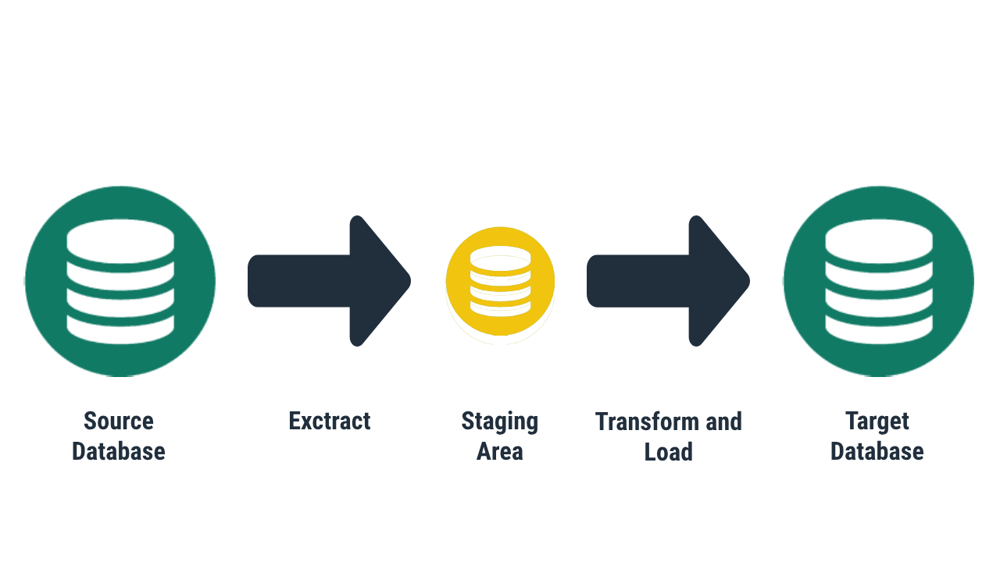

# Serviço Python de Replicação de Dados
Criando um serviço de replicação de dados entre banco de dados relacionais utilizando Python. O objetivo é mover os dados com facilidade, segurança, eficiência e o mínimo impacto operacional.

## ILUSTRAÇÃO DO ETL

</img>

Essa imagem ilustra o processo ETL (Extract, Transform, Load), que é amplamente utilizado em sistemas de integração de dados. Aqui está a explicação detalhada dos componentes:

1. **Source Database (Banco de Dados de Origem)**:
   - Representa a origem dos dados. Pode ser um banco de dados relacional, um arquivo CSV, um sistema de ERP, ou qualquer outro sistema onde os dados são armazenados.
   - A etapa inicial é extrair os dados desse banco.

2. **Extract (Extração)**:
   - É o processo de recuperar os dados das fontes originais.
   - Nesta etapa, os dados são coletados e enviados para uma área temporária (staging area) para processamento posterior.

3. **Staging Area (Área de Staging)**:
   - Funciona como uma área intermediária onde os dados brutos extraídos são armazenados temporariamente.
   - Permite realizar transformações nos dados antes de carregá-los no destino final.
   - Aqui, os dados podem ser limpos, validados ou enriquecidos.

4. **Transform and Load (Transformação e Carga)**:
   - **Transformação**: Os dados passam por processos como limpeza, formatação, agregação, ou cálculos para estarem no formato necessário para o destino.
   - **Carga**: Após a transformação, os dados processados são carregados no banco de dados de destino.

5. **Target Database (Banco de Dados de Destino)**:
   - É o sistema final onde os dados transformados são armazenados.
   - Pode ser um data warehouse ou outro banco de dados projetado para consultas, análises e relatórios.

## ENTIDADES

### 1. ENDPOINT
#### PRÉ-REQUISITOS PARA INSTANCIAR
- Tipo do Banco de Dados
- Tipo do Endpoint (Source ou Target)
- Nome do Banco de Dados
- Credenciais Necessárias
#### FUNCIONALIDADES
##### GERAL
- Obter Schemas das Tabelas
##### SOURCE
- Obter relação de Schemas do Banco de Dados
- Obter relação de Tabelas do Banco de Dados
- Obter Metadados de Contagem das Tabelas
- Extrair os dados das Tabelas (Full Load)
- Capturar DML em Tabelas (CDC) 
##### TARGET
- Inserir dados em Tabelas no modo Full Load
- Inserir dados em Tabelas no modo CDC