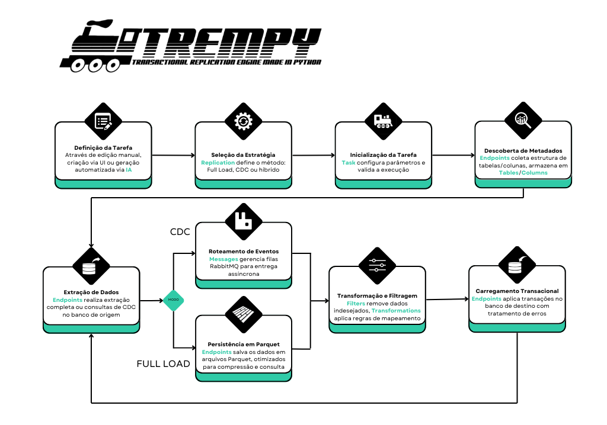

## Descrição
O **TREMpy** é uma sistema de replicação transacional desenvolvido em Python, projetado para facilitar a replicação de dados entre SGBDs (inicialmente projeto para PostgreSQL) utilizando técnicas modernas de captura de dados de alteração (CDC) e integração com mensageria via RabbitMQ. Com uma interface intuitiva baseada em Streamlit e suporte a orquestração via Docker, o TREMpy oferece uma solução flexível e extensível para cenários de replicação, monitoramento e automação de fluxos de dados.

## Conteúdos
- [Inspirações e Referências Técnicas](#inspirações-e-referências-técnicas)
- [Objetivo Principal](#objetivo-principal)
- [Instalação](#instalação)
- [Usando PostgreSQL](#usando-postgresql)
- [Configuração e Uso do RabbitMQ](#configuração-e-uso-do-rabbitmq)
- [Estrutura do Projeto](#estrutura-do-projeto)
- [Features Principais](#features-principais)
- [Uso da IA](#uso-da-ia)
- [Slowly Changing Dimension Type 2 (SCD2)](#slowly-changing-dimension-type-2-scd2)
- [Ideias Futuras](#ideias-futuras)
- [Licença](#licença)
- [Contato](#contato)

## Inspirações e Referências Técnicas

O TREMpy foi desenvolvido com base nas melhores práticas de ferramentas modernas de replicação de dados, adaptando-as para cenários acessíveis. Nossas principais inspirações foram:

### 1. **Snowflake Streams (CDC)**
</img>
- **Destaques**:  
  - Mecanismo nativo de **Change Data Capture (CDC)** via objetos `STREAM`.  
  - Implementação nativa de **Slowly Changing Dimension Type 2 (SCD2)** usando `STREAMS` e `TASKS`.
  - Rastreia mudanças (INSERT/UPDATE/DELETE) em tabelas com metadados temporais.  
  - Suporte a múltiplos consumidores de dados incrementais.  
- **Limitações**:  
  - Exclusivo do ecossistema Snowflake (não aplicável a SGBDs tradicionais).  
  - Requer configuração manual de streams.  

### 2. **Qlik Replicate**  
</img>
- **Destaques**:  
  - Solução **enterprise** para replicação heterogênea (on-premise/cloud).  
  - Interface gráfica intuitiva para CDC e Full Load.  
  - Suporte a 20+ fontes/destinos (Oracle, SAP, Kafka, etc.).  
- **Limitações**:  
  - Modelo licenciado caro.  
  - Infraestrutura complexa (requer servidores dedicados).  

### Diferencial do TREMpy  
Enquanto essas ferramentas são poderosas, o TREMpy foi projetado para democratizar a replicação de dados:  

| **Recurso**          | **Snowflake/Qlik**               | **TREMpy**                          |  
|----------------------|----------------------------------|-------------------------------------|  
| **Custo**            | Alto (licenças/cloud)            | **Open-source** (sem custos)        |  
| **Stack**            | Ecossistema próprio              | **Qualquer SGBD** (PostgreSQL, MySQL, etc.) |  
| **Complexidade**     | Requer expertise avançada        | **Interface simplificada** (Streamlit) |  
| **CDC**              | Nativo ou via licença            | **Implementação leve** (baseada em triggers/WAL) |  

## Objetivo Principal
Oferecer funcionalidades semelhantes às ferramentas enterprise (CDC, SCD2, transformações), mas com:  
- ✅ **Zero dependência** de vendors caros.  
- ✅ **Compatibilidade** com bancos de dados tradicionais.  
- ✅ **Fácil deploy** (Docker ou execução local).  

### Por que essa abordagem?  
1. **Para times pequenos**: Elimina a necessidade de infraestrutura complexa.  
2. **Para legados**: Permite modernizar bancos antigos sem migração.  
3. **Para desenvolvedores**: API aberta e extensível via Python.  

Se precisar de detalhes técnicos das inspirações, consulte:  
- [Documentação do Snowflake Streams](https://docs.snowflake.com/)  
- [Site oficial do Qlik Replicate](https://www.qlik.com/products/qlik-replicate)  
- [Snowflake SCD2 Guide](https://www.snowflake.com/en/blog/building-a-type-2-slowly-changing-dimension-in-snowflake-using-streams-and-tasks-part-1/)

## Instalação

Antes de começar, certifique-se de que os seguintes pré-requisitos estão instalados no seu ambiente:

- **Python 3.10 ou superior**
- **Docker** (caso deseje executar o projeto em containers)
- **Docker Compose** (para orquestração dos containers)

### Executando Localmente

Você pode executar o TREMpy de duas formas:

1. **Com Interface Gráfica (UI)**:
   ```bash
   streamlit run app.py
   ```
   Isso iniciará a interface Streamlit no endereço `http://localhost:8501`.

2. **Diretamente sem UI** (para execução de tarefas em background):
   ```bash
   python manager.py
   ```

### Executando com Docker

O projeto utiliza Docker para facilitar a orquestração e o isolamento dos serviços. Para executar o projeto em um container Docker, siga os passos básicos abaixo. Para configurações avançadas, consulte o manual completo em [`README_DOCKER.md`](README_DOCKER.md):

```bash
# Construir a imagem
docker-compose build

# Iniciar os serviços
docker-compose up -d
```

### Acessando os Serviços
- Streamlit: http://localhost:${STREAMLIT_PORT:-8501}
- RabbitMQ: http://localhost:15672 (usuário/senha: guest/guest)

## Usando PostgreSQL

Para utilizar o PostgreSQL com o TREMpy, é necessário de um usuário com permissões de **super-user**.

### Sobre Replication Slots no PostgreSQL

O TREMpy utiliza o recurso de *replication slots* do PostgreSQL para garantir a captura confiável e contínua das alterações realizadas no banco de dados de origem. Um replication slot é um mecanismo nativo do PostgreSQL que mantém o histórico das mudanças (WALs) necessárias para que consumidores externos possam ler todas as alterações, sem risco de perda de dados, mesmo que haja interrupções temporárias na conexão.

No contexto do TREMpy, cada tarefa de replicação criada recebe seu próprio replication slot dedicado. Isso permite que múltiplas tarefas operem de forma independente, cada uma acompanhando as alterações de suas tabelas de interesse, sem interferência entre si.

Além disso, o gerenciamento automático dos replication slots pelo TREMpy evita o acúmulo de slots antigos e garante que apenas os slots necessários estejam ativos, otimizando recursos e prevenindo problemas de armazenamento de WALs não consumidos.

</img>

Para mais informações sobre *replicatin slots*, acesse a [documentação oficial](https://www.postgresql.org/docs/9.4/catalog-pg-replication-slots.html)

### Configuração em `postgresql.conf`:
```
wal_level = logical
max_replication_slots = 5 # recomendado > 20
max_wal_senders = 5       # recomendado = max_replication_slots

# Para conexões via Docker
listen_addresses = '*'     # permite conexões de qualquer interface
```

### Configuração em `pg_hba.conf`:
```
# Pré-requisito obrigatório para replicação, tanto usando Docker quanto sem Docker:
host replication all 0.0.0.0/0 trust
```

### Configuração de Rede para Docker
Para garantir que o PostgreSQL aceite conexões do container Docker, adicione as seguintes entradas ao `pg_hba.conf`:

```
host all all 172.17.0.0/16 md5   # rede do Docker
host all all 172.26.64.0/20 md5  # Rede do WSL
host all all 192.168.1.0/24 md5  # Sua rede Wi-Fi
```

> **Nota**: Ao configurar a conexão na interface do Streamlit, use o Endereço IPv4 como host quando estiver rodando a aplicação via Docker. Este é o IP que o container Docker usará para se comunicar com seu PostgreSQL local.

### Limitações

- Usar **filtros** em colunas que não sejam **Chave Primária**, as operações **DELETE** não serão capturadas

## Configuração e Uso do RabbitMQ

O TREMpy implementa um padrão de mensageria com RabbitMQ, organizado em três componentes principais:

### 1. Topologia de Mensagens
- **Exchange Principal**: `trempy_exchange_{task_name}` (tipo direct/duravel)
- **DLX**: `trempy_dlx_exchange_{task_name}` (para tratamento de falhas)
- **Filas**:
  - Principal: `trempy_queue_{task_name}` (com DLX configurada)
  - DLX: `dlx_queue_{task_name}` (armazena mensagens falhas)

### 2. Fluxo de Operação
| Componente         | Função                                                                 | Destaques                                                                 |
|--------------------|-----------------------------------------------------------------------|---------------------------------------------------------------------------|
| **MessageProducer** | Publica mensagens de alterações CDC                        | - Mensagens persistentes (delivery_mode=2) |
| **MessageConsumer** | Consome e processa mensagens da fila principal                       | - Prefetch=1 (processamento serializado)<br>- Ack manual<br>- DLX automática em falhas |
| **MessageDlx**      | Gerencia mensagens falhas na DLX                                     | - Log centralizado de erros       |

### 3. Garantias de Entrega
- **Persistência**: Mensagens sobrevivem a reinicializações do broker
- **Tratamento de Falhas**: 
  - DLX redireciona mensagens não processadas após 3 tentativas
  - Logs estruturados com `transaction_id` para rastreabilidade
- **Controle de Fluxo**: 
  - Prefetch_count=1 evita sobrecarga no consumidor
  - Metadados de performance registrados via `MetadataConnectionManager`

### 4. Fluxo


### Configuração Local do RabbitMQ (Windows)

> **OBS**: Para uso do TREMpy no Docker, esta etapa não é necessária.

#### Pré-requisitos Essenciais
1. Instalar [Erlang](https://www.erlang.org/downloads) (versão compatível)
2. Instalar [RabbitMQ para Windows](https://www.rabbitmq.com/install-windows.html)

#### Configuração Mínima Necessária
```cmd
:: 1. Iniciar serviço (após instalação)
net start RabbitMQ

:: 2. Habilitar interface de gerenciamento (opcional)
rabbitmq-plugins enable rabbitmq_management

:: 3. Reiniciar o serviço
net stop RabbitMQ && net start RabbitMQ
```

#### Verificação Básica
```cmd
:: Acessar interface web (usuário padrão: guest/guest)
start http://localhost:15672

:: Verificar status
rabbitmqctl status
```

#### Observações Importantes:
1. O TREMpy utiliza por padrão:
   - Host: `localhost`
   - Usuário: `guest` (padrão do RabbitMQ)
   - Senha: `guest` (padrão do RabbitMQ)
   - Porta: `5672` (AMQP padrão)

2. Não é necessário criar usuários específicos, pois o código usa as credenciais padrão

3. Para ambientes de produção, recomenda-se:
   ```cmd
   :: 1. Alterar senha do usuário guest
   rabbitmqctl change_password guest nova_senha_segura

   :: 2. Atualizar no arquivo .env do projeto:
   RABBITMQ_HOST=localhost
   ```

> **Nota**: O sistema foi projetado para usar a configuração mínima do RabbitMQ. Para personalizações avançadas, consulte [`README_RABBITMQ.md`](README_RABBITMQ.md).

## Estrutura do Projeto

O núcleo do TREMpy é organizado em módulos especializados conforme a tabela abaixo:

| Módulo          | Descrição                                                                 | Componentes Principais |
|-----------------|----------------------------------------------------------------------------------|---------------------------------------------|
| **Replication** | Núcleo da replicação com estratégias para CDC e Full Load                       | `CDCStrategy.py`, `FullLoadStrategy.py`, `ReplicationManager.py` |
| **Messages**    | Implementa a comunicação via RabbitMQ (produtores/consumidores)                 | `MessageProducer.py`, `MessageConsumer.py` |
| **Tasks**       | Modelagem e execução de tarefas de replicação                                   | `Task.py`                                  |
| **Endpoints**   | Gerencia conexões com bancos de dados (PostgreSQL)          | `Endpoint.py`, `CDCManager.py`, `FullLoadHandler.py` |
| **Tables**      | Representação e operações básicas de tabelas                                    | `Table.py`                                 |
| **Columns**     | Define a estrutura e metadados de colunas para transformação de dados            | `Column.py`                                 |
| **Transformations** | Transformações de dados e geração de colunas derivadas                     | `ColumnModifier.py`, `ColumnCreator.py`, `Transformation.py`   |
| **Filters**     | Aplica regras de filtragem aos dados durante o processamento                    | `Filter.py`                        |
| **IA**          | Integração com IA para automação de tarefas e geração de configurações          | `TaskCreator.py`                           |
| **Loggings**    | Centraliza o sistema de logs e monitoramento da aplicação                       | `Logging.py`                               |
| **Metadata**    | Gerencia metadados do sistema                                 | `MetadataConnectionManager.py` |
| **Shared**      | Utilitários compartilhados (tipos de dados, queries SQL, definitions)               | `Crypto.py`, `Utils.py`, `QueryPostgreSQL.py` |

### Fluxo Principal:



*Os módulos `Shared`, `Metadata` e `Loggings` fornecem suporte transversal a toda a aplicação.*

## Uso da IA

O TREMpy integra a **API da DeepSeek** para automatizar a criação de tarefas de replicação através de linguagem natural, seguindo as especificações documentadas em [`task_creator_tutorial_for_ai.md`](trempy/IA/task_creator_tutorial_for_ai.md).  

### Benefícios da DeepSeek  
| **Vantagem**               | **Descrição**                                                                 |
|----------------------------|------------------------------------------------------------------------------|
| **Custo-efetividade**      | Preço competitivo (~5x menor que GPT-4 Turbo para tarefas equivalentes)     |
| **Performance**            | Otimizada para geração de JSON estruturado com baixa temperatura (`temperature=0`) |
| **Confiabilidade**         | Respostas deterministicas (ideal para configurações técnicas)               |

### Implementação Técnica  
A classe `TaskCreator` utiliza os seguintes parâmetros-chave na chamada à API:  

| **Parâmetro**           | **Valor**               | **Finalidade**                                                                 |
|-------------------------|-------------------------|--------------------------------------------------------------------------------|
| `model`                 | `deepseek-chat`         | Modelo especializado em tarefas técnicas                                      |
| `response_format`       | `json_object`           | Garante saída em JSON válido                                                  |
| `temperature`           | `0`                     | Elimina aleatoriedade (crucial para configurações precisas)                   |
| `messages`              | Sistema + User          | Contexto estruturado conforme documentação do TREMpy                          |

### Fluxo de Operação  
1. **Input do Usuário**:  
   - Descrição em linguagem natural (ex: *"Replique a tabela employees.employee_salary com filtro para salários > 5000 e replique a tabela employees.employee com concatenação de first_name e last_name"*).  

2. **Processamento**:  
   - A IA gera um `settings.json` completo, aplicando:  
     - Enums pré-definidos (ex: `replication_type="full_load_and_cdc"`)  
     - Regras de prioridade entre transformações  
     - Validação de dependências entre colunas  

3. **Saída**:  
   - Configuração pronta para execução, incluindo:  
     ```json
     {
       "task": {
         "replication_type": "full_load_and_cdc",
         "cdc_settings": { "mode": "upsert" }
       },
       "error_handling": { ... },
       "tables": [ ... ],
       "filters": [ ... ],
       "transformations": [ ... ]
     }
     ```

4. **Validação Automática**:  
   - Verifica inconsistências como:  
     - Transformações estruturais sem prioridade `0`  
     - Filtros com operadores inválidos para o tipo de coluna  

> **Para desenvolvedores**: A implementação completa está disponível em `trempy/IA/TaskCreator.py`. Customizações avançadas podem ser feitas via `.env` (ex: alterar `DEEPSEEK_API_KEY` ou URL base).  

</img>

**Caso de Uso Típico**:  
- Prompt para criar uma tarefa de replicação de dados simples: **[prompt_upsert.txt](task/another_tasks/fl-cdc-upsert-employees/prompt_upsert.txt)**
- Prompt para criar uma tarefa de replicação de dados no modo SCD2 com transformações extras: **[prompt_scd2.txt](task/another_tasks/fl-cdc-scd2-employees/prompt_scd2.txt)**

## Features Principais

O TREMpy oferece uma interface para configuração e monitoramento de replicação de dados, com as seguintes funcionalidades:

### 1. Dashboard de Monitoramento
</img>
- Visualização em tempo real dos logs do sistema
- Estatísticas detalhadas de replicação (registros processados, sucesso/falha, tempo de execução)
- Filtros para busca específica de mensagens
- Status atual das tarefas em execução

### 2. Gerenciamento de Conexões
</img>
- Configuração de conexões com bancos de dados origem e destino
- Armazenamento seguro de credenciais

### 3. Configuração de Tarefas
</img>
- **Tipos de Replicação**:
  - `full_load`: Carga completa inicial
  - `cdc`: Captura contínua de alterações
  - `full_load_and_cdc`: Combinação híbrida
- **Modos de Início**:
  - `reload`: Reinicia a replicação do zero
  - `continue`: Retoma de onde parou
- **Configurações Avançadas**:
  - Intervalo de execução personalizável
  - Opção para criação automática de tabelas de destino
  - Controle de truncagem/reconstrução de tabelas
- **SCD2 (Slowly Changing Dimension Type 2)**:
  - Configuração dedicada de colunas temporais:
    - `scd_start_date`: Data de início da vigência
    - `scd_end_date`: Data de término da vigência
    - `scd_current`: Indicador de registro ativo
  - Histórico automático de versões de registros

### 4. Filtros Avançados  
</img>

#### **Tipos de Filtros Suportados**  
| Categoria          | Operadores                     | Inputs Necessários         |
|--------------------|--------------------------------|----------------------------|
| **Comparação**     | `equals`, `not_equals`         | `value`                    |
| **Intervalo**      | `between`, `not_between`       | `lower`, `upper`           |
| **Texto**          | `starts_with`, `ends_with`, `contains`, `not_contains` | `value`       |
| **Listas**         | `in`, `not_in`                 | `values` (array)           |
| **Nulos**          | `is_null`, `is_not_null`       | —                          |
| **Datas**          | `date_equals`, `date_between`, `greater_than`, etc  | `value` ou `lower`/`upper` |

- Aplicáveis a colunas específicas (numéricas, textuais ou datas).
- Interface intuitiva para composição de regras complexas.

### 5. Transformações de Dados  
</img>

#### **Tipos de Transformações**  
| Tipo                  | Operações Suportadas          | Exemplo                      |  
|-----------------------|-------------------------------|------------------------------|  
| **Modificar Valores** | `uppercase`, `lowercase`, `trim`, `format_date` | Padronizar `name` em maiúsculas |  
| **Criar Colunas**     | `concat`, `date_diff_years`, `math_expression`, `literal`, `datetime_now` | `full_name = first_name + ' ' + last_name` |  
| **Renomear**          | `modify_schema_name`, `modify_table_name`, `modify_column_name` | Renomear `emp_id` para `employee_id` |  
| **Chaves Primárias**  | `add_primary_key`, `remove_primary_key` | Definir `created_at` como PK          |  

- **Hierarquia recomendada de prioridades**:
  ```mermaid
  graph TD
    A[Estruturais - Prioridade Muito Alta] --> B[Valor - Prioridade Alta-Média]
    B --> C[Derivadas - Prioridade Baixa-Muito Baixa]
  ```

### 6. Tratamento de Erros
</img>
- Configuração granular de comportamento para falhas:
  - Por tipo de operação (INSERT, UPDATE, DELETE)
  - Por modo de replicação (Upsert, SCD2)
- Políticas de continuidade após erros
- Logs detalhados para diagnóstico

</img>

### 7. Assistente de IA para Criação de Tarefas
**Geração via Linguagem Natural**:
</img>
- **Saída Estruturada**:
  - Gera arquivo `settings.json` completo
  - Aplica enums e padrões documentados
  - Inclui descrições automáticas
- **Validação Automática**:
  - Verifica consistência de prioridades
  - Garante dependências entre transformações
  - Aplica regras de estrutura de tabelas

## Slowly Changing Dimension Type 2 (SCD2)

O TREMpy implementa nativamente o padrão SCD2 para gerenciamento de dimensões que mudam ao longo do tempo:

- **Configuração dedicada**:
  - Colunas para datas de início/fim (scd_start_date, scd_end_date)
  - Indicador de registro atual (scd_current)
- **Funcionamento**:
  - Mantém histórico completo de todas as versões dos registros
  - Atualiza automaticamente os marcadores temporais
  - Preserva a integridade temporal dos dados
- **Benefícios**:
  - Rastreabilidade completa de mudanças
  - Análise histórica facilitada
  - Compatível com ferramentas de BI e data warehousing
  - Configuração nativa via interface (sem código SQL).

### Exemplo 1: Tabela com replicação de dados simples no modo SCD2
**Tabela no banco de dados de origem**  
</img>  
**Tabela no banco de dados de destino**  
</img>  

### Exemplo 2: Tabela com replicação de dados no modo SCD2 com diversas tranformações extras
**Tabela no banco de dados de origem**  
</img>  
**Tabela no banco de dados de destino**  
</img>  

## Ideias Futuras

O TREMpy está em constante evolução, e planejamos as seguintes melhorias futuras:

### 1. Suporte a Multiplos SGBDs
- **Expansão de Compatibilidade**:  
  - Adicionar suporte nativo para MySQL, Oracle, SQL Server e outros SGBDs populares como fontes e destinos de replicação.  
  - Implementar adaptadores específicos para cada banco de dados, mantendo a mesma interface unificada.  

- **Benefícios Esperados**:  
  - Permitir cenários de migração entre bancos heterogêneos (ex: Oracle → PostgreSQL).  

### 2. Migração para Flask
- **Motivação**:  
  - Substituir a interface Streamlit por uma baseada em Flask, oferecendo:  
    - Maior flexibilidade para integrações externas.  
    - Controle mais granular sobre a UI/UX.  

- **Vantagens**:  
  - Arquitetura mais escalável para ambientes enterprise.  

## Licença

Distribuído sob a licença Apache 2.0. Consulte [LICENSE](LICENSE) para informações completas.

**Permissões básicas**:
- Uso, modificação e distribuição livre
- Requer preservação de avisos de copyright
- Isenção de garantias

## Contato

<div align="left" style="display: flex; gap: 10px;">
  <a href="https://www.linkedin.com/in/vlsf2/" target="_blank">
    
  </a>
  <a href="mailto:viniciusluiz14052000@gmail.com">
    
  </a>
  <a href="https://github.com/Vinicius-Luiz" target="_blank">
    
  </a>
</div>