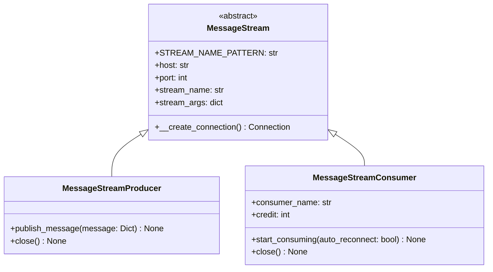
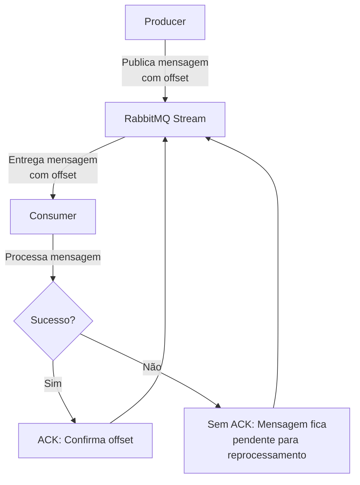

# Documentação Atualizada: RabbitMQ Streams

## Implementação das Classes para RabbitMQ Streams

### Arquitetura Atualizada



## Diferenças Chave: Filas Tradicionais vs Streams

| Característica          | Filas Tradicionais               | Streams                          |
|-------------------------|----------------------------------|----------------------------------|
| **Confirmação**         | ACK/NACK explícitos              | Tracking de offset (ack implícito)|
| **Reprocessamento**     | Requer reenfileiramento          | Basta resetar o offset           |
| **Estado**             | Mensagem removida após ACK       | Mensagem permanece no stream     |
| **Consumo múltiplo**   | Competindo consumers             | Cada consumer tem seu offset     |
| **Retenção**          | Até confirmação                  | Baseado em tamanho/tempo configurado |
| **Performance**       | ~50k msg/s                       | ~1M msg/s                        |
| **DLX**              | Suportado                        | Não aplicável                    |
| **Ordenação**        | Garantida por fila               | Garantida por stream             |

## Fluxo de Trabalho com Offset



### Explicação direta:
1. **Producer** → **Stream**:  
   - Publica mensagens no stream (cada uma tem um **offset** único).

2. **Stream** → **Consumer**:  
   - Entrega mensagens na ordem dos offsets.

3. **Consumer**:  
   - Processa a mensagem.  
   - Se der certo → Envia **ACK** (confirma o offset).  
   - Se falhar → **Não envia ACK** (a mensagem será reenviada).

4. **Stream**:  
   - Remove mensagens confirmadas (ACK).  
   - Mantém as não confirmadas para reprocessamento.

### Pontos-chave:
- **Offset** é como um "ID" sequencial das mensagens.  
- **ACK** = "Já processei, pode descartar".  
- **Sem ACK** = "Preciso tentar de novo".  

## Como Usar as Classes (Atualizado)

### Producer:

```python
producer = MessageStreamProducer(
    task_name="data_replication",
    host="rabbitmq.example.com",
    stream_max_length_bytes=5000000000  # 5GB
)

try:
    message = {
        "id": "12345",
        "operation": "update",
        "data": {"table": "users", "values": {...}}
    }
    producer.publish_message(message)
finally:
    producer.close()  # Importante para liberar recursos
```

### Consumer:

```python
def process_message(message, context):
    try:
        # Seu código de processamento
        print(f"Processed {context['message_id']} (offset {context['offset']})")
        
        # Exemplo de tratamento de erro condicional
        if message.get("should_fail"):
            raise ValueError("Simulated error")
            
    except Exception as e:
        logging.error(f"Failed to process {context['message_id']}: {str(e)}")
        # Não chama ack() automaticamente - será reprocessado

consumer = MessageStreamConsumer(
    task_name="data_replication",
    external_callback=process_message,
    consumer_name="worker_01",  # Identificador único para tracking
    credit=500  # Número de mensagens para pré-buscar
)

consumer.start_consuming(auto_reconnect=True)  # Reconexão automática habilitada
```

## Gerenciamento de Offsets (Adicional)

1. **Consultar offset atual**:
   ```python
   last_offset = consumer.consumer.query_offset(
       stream=consumer.stream_name,
       reference=consumer.consumer_name
   )
   ```

2. **Resetar offset manualmente**:
   ```python
   consumer.consumer.store_offset(
       stream=consumer.stream_name,
       offset=0,  # Para começar do início
       reference=consumer.consumer_name
   )
   ```

3. **Monitorar via CLI**:
   ```bash
   rabbitmq-streams list_consumers --stream trempy_stream_data_replication
   ```

## Tratamento de Erros Avançado

1. **Stream de Erros Dedicado**:
   ```python
   error_producer = MessageStreamProducer("data_replication_errors")
   
   def process_message(message, context):
       try:
           # Processamento normal
       except Exception as e:
           error_message = {
               "original": message,
               "error": str(e),
               "timestamp": time.time(),
               "offset": context["offset"]
           }
           error_producer.publish_message(error_message)
           # Não faz ack da mensagem original
   ```

2. **Mecanismo de Retry**:
   ```python
   def process_with_retry(message, context, max_retries=3):
       retry_count = 0
       while retry_count < max_retries:
           try:
               # Tentativa de processamento
               context.ack()
               break
           except Exception:
               retry_count += 1
               time.sleep(2 ** retry_count)  # Backoff exponencial
       else:
           logging.error(f"Max retries reached for {message['id']}")
   ```

## Recomendações de Configuração

1. **Para Alta Carga**:
   ```python
   producer = MessageStreamProducer(
       task_name="high_volume",
       stream_max_length_bytes=20000000000,  # 20GB
       credit=2000  # Maior buffer para producers
   )
   ```

2. **Para Processamento Crítico**:
   ```python
   consumer = MessageStreamConsumer(
       task_name="critical_data",
       consumer_name=f"critical_worker_{os.getpid()}",  # Nome único
       credit=100  # Menor credit para maior controle
   )
   ```

3. **Monitoramento**:
   - Acompanhe métricas via API de administração
   - Configure alertas para:
     - Crescimento acelerado de streams
     - Consumers com offset estagnado
     - Taxa de publicação/consumo