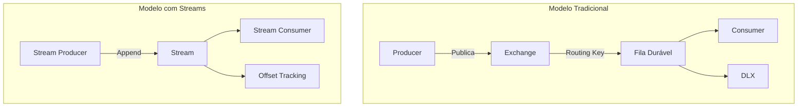
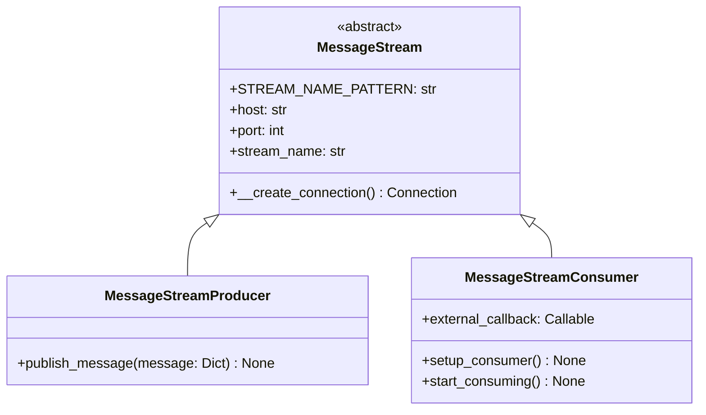
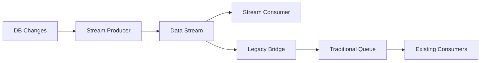

# Documentação Atualizada com RabbitMQ Streams

## Configuração Inicial no Windows

### ✅ Passos Comprovados para Iniciar o RabbitMQ com Streams

1. **Habilitar o plugin de Streams**:
   ```cmd
   rabbitmq-plugins enable rabbitmq_stream rabbitmq_stream_management
   ```

2. **Reiniciar o serviço**:
   ```cmd
   net stop RabbitMQ && net start RabbitMQ
   ```

## Arquitetura do Sistema

### Fluxo Tradicional vs Stream






## Implementação com Streams

### Producer com Streams (Novo)

```python
from rabbitmq_stream import Producer, AMQPMessage

def setup_stream_producer(stream_name: str):
    producer = Producer(
        host='localhost',
        port=5552,  # Porta padrão para streams
        username='guest',
        password='guest'
    )
    
    # Declara o stream se não existir
    producer.declare_stream(
        stream=stream_name,
        exists_ok=True,
        arguments={
            'max-length-bytes': 1000000000,  # 1GB
            'max-age': '1h'  # Rotação horária
        }
    )
    
    return producer

def publish_to_stream(producer, stream_name, data):
    message = AMQPMessage(
        body=json.dumps(data).encode(),
        properties={
            'message_id': data.get('id'),
            'content_type': 'application/json'
        }
    )
    
    producer.send(
        stream=stream_name,
        message=message
    )
    print(f" [x] Sent to stream '{stream_name}':{data['id']}")
```

### Consumer com Streams (Novo)

```python
from rabbitmq_stream import Consumer, OffsetType

def setup_stream_consumer(stream_name: str, callback: Callable):
    consumer = Consumer(
        host='localhost',
        port=5552,
        username='guest',
        password='guest',
        callback=callback
    )
    
    consumer.subscribe(
        stream=stream_name,
        offset_specification=OffsetType.FIRST,  # Ou OffsetType.NEXT
        credit=1000  # Número de mensagens para pré-buscar
    )
    
    return consumer

def stream_callback(message, context):
    try:
        data = json.loads(message.body)
        print(f" [x] Received from stream: {data['id']}")
        # Processamento aqui...
        context.ack()  # Confirma o offset
    except Exception as e:
        print(f" [!] Error: {str(e)}")
        # Log do erro, mas não há DLX em streams
```

## Comparativo: Filas vs Streams

| Característica          | Filas Tradicionais               | Streams                          |
|-------------------------|----------------------------------|----------------------------------|
| Modelo de consumo       | Compete-consumer                 | Consumo múltiplo (replay)        |
| Retenção                | Após ACK                         | Baseado em tamanho/tempo         |
| Performance             | ~50k msg/s                       | ~1M msg/s                        |
| DLX                     | Suportado                        | Não aplicável                    |
| Ordenação               | Garantida por fila               | Garantida por stream             |
| Offset tracking         | Não                              | Sim                              |
| TTL                    | Por mensagem                     | Por stream                       |

## Boas Práticas com Streams (Novo)

1. **Configuração de Stream**:
   - Defina `max-length-bytes` e `max-age` conforme seu caso de uso
   - Para replicação de dados: considere valores altos (ex: 10GB)

2. **Monitoramento**:
   ```bash
   rabbitmq-streams list_streams
   rabbitmq-streams stream_status {nome_do_stream}
   ```

3. **Consumo**:
   - Use `OffsetType` apropriado (FIRST para replay, NEXT para novas mensagens)
   - Ajuste o `credit` para balancear throughput e uso de memória

4. **Tratamento de Erros**:
   - Implemente log próprio de mensagens problemáticas
   - Considere um stream separado para erros

## Exemplo de Implementação Híbrida

Para transição gradual, você pode usar ambos os modelos:



## Recomendações Finais Atualizadas

1. **Migração para Streams**:
   - Comece com streams para novos componentes
   - Mantenha filas tradicionais para sistemas legados
   - Considere um período de operação paralela

2. **Monitoramento Específico**:
   ```bash
   rabbitmq-streams monitor {stream_name} --interval 5
   ```

3. **Acesso à Interface Web**:
   - Os streams aparecem na interface em `http://localhost:15672`
   - Nova aba "Streams" com métricas específicas

4. **Performance**:
   - Para alta vazão: aumente o tamanho do chunk (padrão: 4096 KB)
   - Teste com `rabbitmq-streams performance_test`

5. **Próximos Passos**:
   - Implemente o consumer com tracking de offset
   - Adicione métricas de throughput no producer
   - Considere partições para streams muito grandes