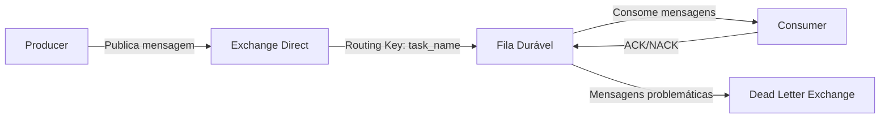

# Documentação Consolidada do RabbitMQ

## Configuração Inicial no Windows

### ✅ Passos Comprovados para Iniciar o RabbitMQ

1. **Iniciar o serviço RabbitMQ**:
   ```cmd
   net start RabbitMQ
   ```

2. **Adicionar ao PATH** (caso necessário):
   - Pressione `Win + R` → Digite `sysdm.cpl` → "Variáveis de Ambiente"
   - Em "Variáveis do sistema", edite `Path` → Adicione:
     ```
     C:\Program Files\RabbitMQ Server\rabbitmq_server-{versão}\sbin
     ```

### 🔍 Verificação Final
Para confirmar que tudo está funcionando:
```cmd
rabbitmqctl status
```
Deve mostrar informações do servidor, incluindo:
- Versão do Erlang/OTP
- Status dos plugins
- Uso de memória

### ⚠️ Solução para Problemas com Cookies Erlang
O RabbitMQ usa o cookie Erlang como mecanismo de segurança. Para resolver problemas de autenticação:

1. Iguale os cookies entre:
   - Servidor: `C:\Windows\System32\config\systemprofile\.erlang.cookie`
   - Usuário: `C:\Users\[SeuUsuário]\.erlang.cookie`

2. Recomendações:
   - Mantenha permissões restritas no arquivo
   - Faça backup do cookie válido
   - Reinicie os serviços após alterações

## Arquitetura do Sistema

### Fluxo Básico


## Implementação

### Producer
```python
import pika
import json

def setup_producer():
    connection = pika.BlockingConnection(
        pika.ConnectionParameters(host='localhost')
    )
    channel = connection.channel()
    
    # Declara a exchange direct durável
    channel.exchange_declare(
        exchange='data_replication',
        exchange_type='direct',
        durable=True
    )
    
    return channel

def publish_task(channel, task_name, data):
    message = json.dumps(data)
    
    channel.basic_publish(
        exchange='data_replication',
        routing_key=task_name,
        body=message,
        properties=pika.BasicProperties(
            delivery_mode=2,  # Torna a mensagem persistente
            content_type='application/json'
        )
    )
    print(f" [x] Sent '{task_name}':{message}")
```

### Consumer
```python
import pika
import json

def structure_capture_changes_to_dataframe(message):
    try:
        data = json.loads(message)
        if 'id' not in data:
            raise ValueError("ID faltando")
        return True
    except Exception as e:
        print(f"Erro no processamento: {str(e)}")
        return False

def setup_consumer(task_name):
    connection = pika.BlockingConnection(
        pika.ConnectionParameters(host='localhost')
    )
    channel = connection.channel()
    
    args = {
        'x-dead-letter-exchange': 'dlx_replication',
        'x-dead-letter-routing-key': f'dlx.{task_name}'
    }
    
    channel.queue_declare(
        queue=task_name,
        durable=True,
        arguments=args
    )
    
    channel.queue_bind(
        exchange='data_replication',
        queue=task_name,
        routing_key=task_name
    )
    
    channel.basic_qos(prefetch_count=1)
    
    def callback(ch, method, properties, body):
        print(f" [x] Received {body.decode()}")
        
        if structure_capture_changes_to_dataframe(body.decode()):
            ch.basic_ack(delivery_tag=method.delivery_tag)
            print(" [x] Processamento concluído com sucesso")
        else:
            ch.basic_nack(delivery_tag=method.delivery_tag, requeue=False)
            print(" [!] Mensagem rejeitada (enviada para DLX)")
    
    channel.basic_consume(
        queue=task_name,
        on_message_callback=callback,
        auto_ack=False
    )
    
    return channel
```

### Configuração da Dead Letter Exchange (DLX)
```python
def setup_dlx():
    connection = pika.BlockingConnection(
        pika.ConnectionParameters(host='localhost')
    )
    channel = connection.channel()
    
    channel.exchange_declare(
        exchange='dlx_replication',
        exchange_type='topic',
        durable=True
    )
    
    channel.queue_declare(
        queue='failed_replication_tasks',
        durable=True
    )
    
    channel.queue_bind(
        exchange='dlx_replication',
        queue='failed_replication_tasks',
        routing_key='dlx.*'
    )
    
    def dlx_callback(ch, method, properties, body):
        print(f" [DLX] Received failed message: {body.decode()}")
        ch.basic_ack(delivery_tag=method.delivery_tag)
    
    channel.basic_consume(
        queue='failed_replication_tasks',
        on_message_callback=dlx_callback,
        auto_ack=False
    )
    
    return channel
```

## Boas Práticas Implementadas

1. **Confirmação de Mensagens**:
   - ACK explícito somente após processamento bem-sucedido
   - NACK para mensagens inválidas (sem requeue)

2. **Durabilidade**:
   - Mensagens persistentes (`delivery_mode=2`)
   - Filas duráveis (`durable=True`)

3. **Tratamento de Erros**:
   - Dead Letter Exchange para mensagens problemáticas
   - Padrão de routing key `dlx.<original_task_name>`

4. **Controle de Fluxo**:
   - Prefetch Count = 1 para processamento serializado

## Execução e Monitoramento

### Comandos para Execução
```bash
# Terminal 1
start python dlx_manager.py
start python consumer.py
python producer.py
```

### Comandos Úteis para Monitoramento
```bash
rabbitmqctl list_queues name messages_ready
rabbitmqctl list_exchanges
rabbitmqctl list_bindings
rabbitmq-plugins enable rabbitmq_management
```

### Acesso à Interface Web
```
http://localhost:15672
```
Usuário: `guest` | Senha: `guest`

## Recomendações Finais

1. **Monitoramento**:
   - Verifique filas não consumidas
   - Monitore a fila `failed_replication_tasks`
   - Acompanhe métricas de tempo de processamento e taxas de ACK/NACK

2. **Tratamento de Problemas**:
   - Para erros de porta: reinicie o serviço RabbitMQ
   - Para problemas de conexão Python: implemente tentativas de reconexão
   - Em ambientes de cluster: todos os nós devem compartilhar o mesmo cookie Erlang

3. **Próximos Passos**:
   - Teste os scripts em paralelo usando `start`
   - Monitore as filas em tempo real
   - Consulte os logs em `C:\Users\[SeuUsuário]\AppData\Roaming\RabbitMQ\log` para diagnóstico