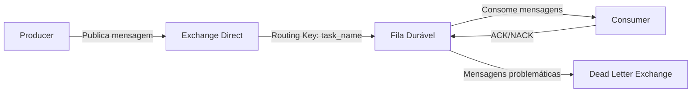

# RabbitMQ - Documentação da Ferramenta de Replicação de Dados

## Arquitetura do Sistema

### Fluxo Básico


`producer`
```python
import pika
import json

def setup_producer():
    connection = pika.BlockingConnection(
        pika.ConnectionParameters(host='localhost')
    )
    channel = connection.channel()
    
    # Declara a exchange direct durável
    channel.exchange_declare(
        exchange='data_replication',
        exchange_type='direct',
        durable=True
    )
    
    return channel

def publish_task(channel, task_name, data):
    message = json.dumps(data)
    
    channel.basic_publish(
        exchange='data_replication',
        routing_key=task_name,
        body=message,
        properties=pika.BasicProperties(
            delivery_mode=2,  # Torna a mensagem persistente
            content_type='application/json'
        )
    )
    print(f" [x] Sent '{task_name}':{message}")

# Exemplo de uso
channel = setup_producer()
publish_task(channel, 'user_data_sync', {'action': 'update', 'id': 42})
```

`consumer`
```python
import pika
import json

def structure_capture_changes_to_dataframe(message):
    # Lógica de transformação dos dados
    try:
        data = json.loads(message)
        # Processamento simulado
        if 'id' not in data:
            raise ValueError("ID faltando")
        return True
    except Exception as e:
        print(f"Erro no processamento: {str(e)}")
        return False

def setup_consumer(task_name):
    connection = pika.BlockingConnection(
        pika.ConnectionParameters(host='localhost')
    )
    channel = connection.channel()
    
    # Configura DLX
    args = {
        'x-dead-letter-exchange': 'dlx_replication',
        'x-dead-letter-routing-key': f'dlx.{task_name}'
    }
    
    # Declara fila durável
    channel.queue_declare(
        queue=task_name,
        durable=True,
        arguments=args
    )
    
    # Faz o bind com a exchange
    channel.queue_bind(
        exchange='data_replication',
        queue=task_name,
        routing_key=task_name
    )
    
    # Configura prefetch
    channel.basic_qos(prefetch_count=1)
    
    def callback(ch, method, properties, body):
        print(f" [x] Received {body.decode()}")
        
        if structure_capture_changes_to_dataframe(body.decode()):
            ch.basic_ack(delivery_tag=method.delivery_tag)
            print(" [x] Processamento concluído com sucesso")
        else:
            ch.basic_nack(delivery_tag=method.delivery_tag, requeue=False)
            print(" [!] Mensagem rejeitada (enviada para DLX)")
    
    channel.basic_consume(
        queue=task_name,
        on_message_callback=callback,
        auto_ack=False
    )
    
    return channel

# Exemplo de uso
consumer = setup_consumer('user_data_sync')
print(' [*] Waiting for messages. To exit press CTRL+C')
consumer.start_consuming()
```

#### Configuração da Dead Letter Exchange
```python
def setup_dlx():
    connection = pika.BlockingConnection(
        pika.ConnectionParameters(host='localhost')
    )
    channel = connection.channel()
    
    # Exchange principal para DLX
    channel.exchange_declare(
        exchange='dlx_replication',
        exchange_type='topic',
        durable=True
    )
    
    # Fila para mensagens falhas
    channel.queue_declare(
        queue='failed_replication_tasks',
        durable=True
    )
    
    # Bind com padrão de routing key
    channel.queue_bind(
        exchange='dlx_replication',
        queue='failed_replication_tasks',
        routing_key='dlx.*'
    )
    
    def dlx_callback(ch, method, properties, body):
        print(f" [DLX] Received failed message: {body.decode()}")
        # Lógica para lidar com mensagens falhas (log, alerta, etc.)
        ch.basic_ack(delivery_tag=method.delivery_tag)
    
    channel.basic_consume(
        queue='failed_replication_tasks',
        on_message_callback=dlx_callback,
        auto_ack=False
    )
    
    return channel

# Rodar em processo separado
dlx_consumer = setup_dlx()
dlx_consumer.start_consuming()
```

#### Boas Práticas Implementadas
1. Confirmação de Mensagens (Acknowledgements)
2. ACK explícito somente após structure_capture_changes_to_dataframe()
3. NACK para mensagens inválidas (sem requeue)
4. Prefetch Count = 1 para processamento serializado

2. Durabilidade
```python
# Producer
properties=pika.BasicProperties(
    delivery_mode=2,  # Mensagem persistente
    content_type='application/json'
)

# Consumer
channel.queue_declare(
    queue=task_name,
    durable=True,  # Fila persiste após reinicialização
    arguments=args
)
```

3. Tratamento de Erros com DLX
- Mensagens problemáticas são roteadas para dlx_replication
- Padrão de routing key dlx.<original_task_name>
- Processamento especializado para mensagens falhas

### Monitoramento Recomendado
1. Filas não consumidas: Verificar se há mensagens acumulando
2. DLX: Monitorar fila failed_replication_tasks
3. Métricas: Tempo de processamento, taxa de ACK/NACK

### Exemplo Completo de Fluxo
1. Producer publica mensagem para user_data_sync
2. Exchange direciona para fila user_data_sync
3. Consumer:
    - Processa com structure_capture_changes_to_dataframe()
    - Se sucesso → ACK
    - Se falha → NACK (envia para DLX)
4. Mensagens na DLX são registradas para análise posterior

```
Esta documentação cobre toda a implementação proposta, com exemplos de código prontos para uso e explicações detalhadas de cada componente. Você pode adaptar os nomes de exchanges, filas e métodos conforme a necessidade específica do seu projeto.
``` 