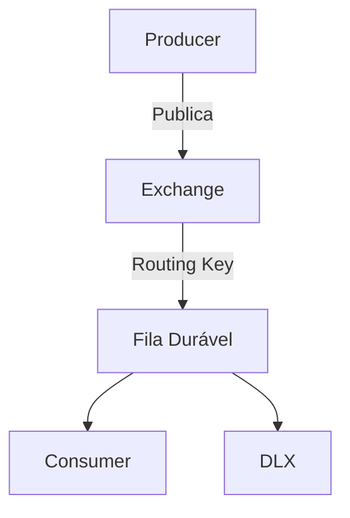

Aqui está a documentação revisada, removendo todo o conteúdo relacionado a RabbitMQ Streams e adicionando comandos específicos para Windows:

# Documentação RabbitMQ para Windows

## Configuração Inicial no Windows

### ✅ Passos Comprovados para Gerenciamento do RabbitMQ

1. **Gerenciamento de serviços**:
   ```cmd
   :: Ver status do serviço
   sc query RabbitMQ

   :: Iniciar serviço
   net start RabbitMQ

   :: Parar serviço
   net stop RabbitMQ

   :: Reiniciar serviço
   net stop RabbitMQ && net start RabbitMQ
   ```

2. **Habilitar plugins** (incluindo UI):
   ```cmd
   :: Habilitar plugins básicos
   rabbitmq-plugins enable rabbitmq_management

   :: Habilitar mais plugins (exemplo)
   rabbitmq-plugins enable rabbitmq_management_agent rabbitmq_shovel rabbitmq_shovel_management

   :: Listar plugins instalados
   rabbitmq-plugins list
   ```

3. **Gerenciar interface web**:
   ```cmd
   :: Iniciar apenas o plugin de gestão
   rabbitmq-plugins enable rabbitmq_management

   :: Acessar a interface (após iniciar o serviço)
   start http://localhost:15672
   ```

## Arquitetura do Sistema

### Fluxo Tradicional



## Comandos Úteis no Windows

1. **Verificar status**:
   ```cmd
   rabbitmqctl status
   ```

2. **Listar filas**:
   ```cmd
   rabbitmqctl list_queues
   ```

3. **Listar exchanges**:
   ```cmd
   rabbitmqctl list_exchanges
   ```

4. **Listar conexões**:
   ```cmd
   rabbitmqctl list_connections
   ```

5. **Gerenciar usuários**:
   ```cmd
   :: Adicionar usuário
   rabbitmqctl add_user meu_usuario minha_senha

   :: Definir permissões
   rabbitmqctl set_permissions meu_usuario ".*" ".*" ".*"

   :: Tornar administrador
   rabbitmqctl set_user_tags meu_usuario administrator
   ```

## Reinicialização Completa

Para reiniciar completamente o RabbitMQ (incluindo dados):
```cmd
net stop RabbitMQ
timeout /t 5 /nobreak
rd /s /q "%APPDATA%\RabbitMQ"
net start RabbitMQ
```

## Solução de Problemas

1. **Serviço não inicia**:
   ```cmd
   :: Ver logs
   type "%APPDATA%\RabbitMQ\log\rabbit@%COMPUTERNAME%.log"

   :: Reinstalar serviço
   rabbitmq-service remove
   rabbitmq-service install
   rabbitmq-service start
   ```

2. **Reset completo**:
   ```cmd
   net stop RabbitMQ
   rabbitmq-service remove
   rabbitmq-service install
   rabbitmq-plugins enable rabbitmq_management
   net start RabbitMQ
   ```

## Configuração Avançada

1. **Editar arquivo de configuração**:
   ```cmd
   notepad "%APPDATA%\RabbitMQ\rabbitmq.conf"
   ```

2. **Exemplo de configuração básica**:
   ```ini
   # Limite de memória (em MB)
   vm_memory_high_watermark.absolute = 2048

   # Tamanho máximo de mensagem (em bytes)
   max_message_size = 134217728  # 128MB
   ```

3. **Aplicar configurações**:
   ```cmd
   net stop RabbitMQ
   net start RabbitMQ
   ```

Esta versão mantém apenas as informações relevantes para o RabbitMQ tradicional no ambiente Windows, com foco nos comandos práticos de gerenciamento.